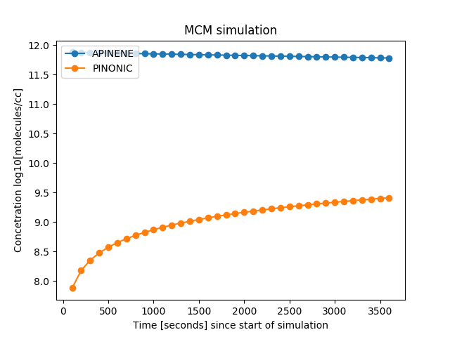
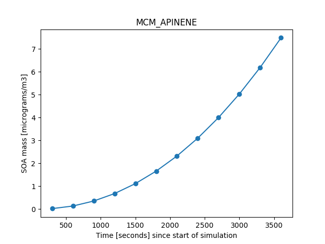
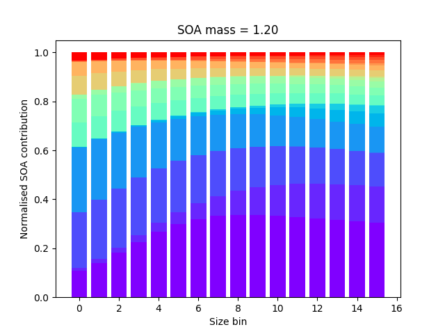

# PyBox

PyBox is a Python based box-model generator and simulator designed for atmospheric chemistry and aerosol studies. The first phase of the PyBox project is to develop a gas phase model, using the reaction information within the [Master Chemical Mechanism (MCM)](http://mcm.leeds.ac.uk/MCM/) as the basis, coupled with an idealised sectional aerosol model. PyBox also relates component properties, using molecular structural information, through the [UManSysProp](http://umansysprop.seaes.manchester.ac.uk) informatics suite.  Any public release will occur according to new processes added, agreement from any partner contributions and/or associated peer-review papers.

Please check the project wiki page for more information on updates and planned releases. 

This project is licensed under the terms of the GNU General Public License v3.0, as provided with this repository. 

# Table of contents
1. [Model overview](#Model-overview)
2. [Dependencies](#Dependencies)
3. [Folder structure and running the model](#Folder-Structure)
4. [Automated unit tests](#Automated-unit-tests)
5. [Contributing](#Contributing)
6. [Code of Conduct](#Code-of-Conduct)

## Model overview

PyBox works on the basis of reading a file that defines reactions between compounds in the gas phase and the associated reaction coefficient. For example, take the MCM [Alpha-Pinene](https://en.wikipedia.org/wiki/Alpha-Pinene) chemical mechanism file  'MCM_APINENE.eqn.txt' stored in the 'mechanism_files' directory of PyBox. This contains the following snippet of text:

     {125.} 	 C96OOH + OH = C96O2 : 	1.90D-12*EXP(190/TEMP) 	;
     {126.} 	 C96OOH + OH = NORPINAL + OH : 	1.30D-11 	;
     {127.} 	 C96OOH = C96O + OH : 	J(41)+J(22) 	;
     {128.} 	 C96NO3 + OH = NORPINAL + NO2 : 	2.88D-12 	;
     {129.} 	 C96NO3 = C96O + NO2 : 	J(53)+J(22) 	;
     {130.} 	 C96O = C97O2 : 	4.20D+10*EXP(-3523/TEMP) 	;
     {131.} 	 C96OH + OH = NORPINAL + HO2 : 	7.67D-12 	;
     {132.} 	 C96OH = C96O + HO2 : 	J(22) 	;

Where the equation number is defined first, then the reactants/products along with a defined rate coefficient. This equation file is parsed by functions in 'Parse_eqn_file.py', providing information that can be used to set up and solve the relevant ordinary differential equations (ODEs) to simulate the evolution of the chemical mechanism.  Each component in this chemical mechanism also has an associated record of chemical structure in the form of a [SMILES string](http://www.daylight.com/dayhtml/doc/theory/theory.smiles.html). This information is carried in a .xml file, provided by the MCM, and stored in the root directory of PyBox. Why is this important? Well, this information is taken by the [UManSysProp](http://umansysprop.seaes.manchester.ac.uk) informatics suite and allows us to predict properties of each compound that helps us predict whether they are likely to remain in the gas phase or condense to an existing particulate phase through gas-to-particle partitioning. Before we take a look at the directory structure provided in this repository, lets deal with the dependencies.

## Dependencies

PyBox has been built in the [Anaconda Python 3.6 environment](https://www.anaconda.com/download/#macos). Utilised modules included within the Anaconda environment are:

 - Numpy
 - Scipy
 - Matplotlib
 - unittest
 - shutil
 - xml.dom
 - multiprocessing
 
Additional dependencies are:

- [Assimulo](http://www.jmodelica.org/assimulo). This is the numerical core of PyBox. The Assimulo Ordinary Differential Equation (ODE) solver package allows us to use solvers designed for stiff systems. As found on the project website, there are multiple [methods for installation](https://jmodelica.org/assimulo/installation.html), including both package managers and compiling from source.  From my own experience, it is better to build from source against your Anaconda Python environment. You will need to point to the location of the [Sundials solver suite](https://computation.llnl.gov/projects/sundials) and both BLAS and LAPACK. You can check if your Assimulo installation has worked by opening an interactive Python shell and typing:

> from assimulo.solvers import RodasODE, CVode

- [UManSysProp](http://umansysprop.seaes.manchester.ac.uk). As described on the UManSysProp project page, this model was developed at the University of Manchester under a research grant in order to automate predictions of pure component and mixture properties. This suite requires the Python interface to the [OpenBabel](https://openbabel.org/docs/dev/UseTheLibrary/Python_Pybel.html) package and uses [Flask WTF](https://flask-wtf.readthedocs.io/en/stable/) to deliver a web based facility. You can clone the suite from the [project Github page](https://github.com/loftytopping/UManSysProp_public). Once you have cloned the repository, you will need to add the location of it in the python script 'Property_calculation.py' within the 'Aerosol' directory of PyBox. As with the Assimulo package, you can test this import by opening an interactive Python shell and typing:

> import sys

> sys.path.append('<-- add your path here -->/UManSysProp_public/')

> from umansysprop import boiling_points

> from umansysprop import vapour_pressures

> from umansysprop import critical_properties

> from umansysprop import liquid_densities

> from umansysprop import partition_models

> from umansysprop.forms import CoreAbundanceField

Other dependecies include:

- [f2py](https://docs.scipy.org/doc/numpy-1.13.0/f2py/index.html), the Fortran to Python Interface Generator, which is now included in Numpy. 

- [Numba](https://numba.pydata.org) to generate optimized machine code using the LLVM compiler infrastructure at import time, runtime, or statically. As noted on the project website, the easiest way to install numba is by using the Anaconda Distribution:

> conda install numba

- [gfortran compiler with support for OpenMP](https://gcc.gnu.org/wiki/openmp) if you would like to exploit multicore capabilities of your system in the Python+Fortran model variants included in folders named 'f2py'. I have not yet tested PyBox using proprietary compilers.

## Folder structure and running the model 

If you are happy all dependencies are installed and working, to run PyBox 'out of the box', type the following in the root directory:

> python Gas_simulation.py

You will see a plot displaying the concentration of two compounds over time. To understand what this simulation has actually done, let us now discuss the repository structure.

### Directory layout

    .                           # Gas phase only model [using Numba]
    ├── f2py                    # Gas phase only model [using f2py Fortran to Python Interface Generator] 
    ├── Aerosol                 # Coupled gas and gas-to-particle partitioning routines
    |------f2py                 # Coupled gas and gas-to-particle partitioning routines [using f2py]
    ├── test                    # Automated unit tests
    |------data                 # Data used in the automated unit tests
    ├── mechanism_files         # Copies of chemical mechanisms
    ├── LICENSE
    └── README.md
    
Currently there are two versions of the gas phase only model; one held within the root directory and the other in folder 'f2py':
   
#### 1) Python [using Numba]
This is the default version in the root directory. Recall the parsing of the equation file? After new python scripts are created for use within the ODE solvers, the [Numba](https://numba.pydata.org) package then compiles these before the first simulation. Numba does this as the modules are imported. You will therefore find the initial pre-simulation stages of the first simulation will take some time, but not in subsequent model simulations if you wish to study a fixed chemical mechanism. In this case Numba will not need to re-compile even when you start with new initial conditions. Once you have conducted your first simulation, you may change the following within 'Gas_simulation.py':

    files_exist = False

to

    files_exist = True

The current version of PyBox provides you with an out-of-the-box example. It is based on the MCM representation of the degredation of [Alpha-Pinene](https://en.wikipedia.org/wiki/Alpha-Pinene). The Alpha-Pinene mechanism file is stored within the 'mechanism_files' folder and referenced in the 'Gas_simulation.py' file through: 

    filename='MCM_APINENE'

As already noted, to run the model, once you are happy all dependecies are installed, type the following from the root directory:

> python Gas_simulation.py

You can modify the ambient conditions and species concentrations in 'Gas_simulation.py'. First you can define ambient conditions and simulation time, the default given as :

    temp=288.15 # Kelvin
    RH=0.5 # RH/100% [range 0-0.99]
    #Define a start time 
    hour_of_day=12.0 # 24 hr format
    simulation_time= 7200.0 # seconds
    batch_step=100.0 # seconds
    
The 'batch_step' variable allows us to define when to stop/start/record outputs from our simulation for later use. The ODE methods can provide output at every internal time-step, so it is up to the user to use this information, or not, within the output of the 'ODE_solver.py' script.  Following this, the default option for species concentrations is provided as:

    # Define initial concentrations, in pbb, of species using names from KPP file
    species_initial_conc=dict()
    species_initial_conc['O3']=18.0
    species_initial_conc['APINENE']=30.0

If you run 'Gas_simulation.py' as provided you will see a simple plot of Alpha-Pinene concentration decay over 2 hours.

#### 2) Python + Fortran [using f2py Fortran to Python Interface Generator] 
Whilst the above variant uses the Numba package, in the folder 'f2py' the same model is constructed using the [F2Py](https://docs.scipy.org/doc/numpy/f2py/)package, where functions that define the ODEs are converted into pre-compiled Fortran modules with the option to use [OpenMP](http://www.openmp.org) to exploit the number of cores available to you on any given platform. As before, please check the relevant files for defining initial conditions, species concetrations, and expect some compilation time during the first run. To run this simulation, type the following from the f2py directory:

> python Gas_simulation_f2py.py

<em>Example output from the default gas phase simulation of Alpha-Pinene</em>

### Aerosol

In the Aerosol folder you can find gas-to-particle partitioning frameworks. There are two examples provided. The first, within the f2py folder, simulates the partitioning of compounds to 16 size bins again from the Alpha-Pinene chemical mechanism as this evolves over time. This uses properties calculated from the UManSysProp suite. To run the model, once you are happy all dependencies are installed, type the following from the Aerosol/f2py directory:

> python Aerosol_simulation_f2py

In addition to the species concentrations and ambient conditions, you can change the size distribution and number of size bins in the following:

    num_bins=16 #Number of size bins
    total_conc=100 #Total particles per cc
    std=2.2 #Standard Deviation
    lowersize=0.01 #microns
    uppersize=1.0 #microns
    meansize=0.2 #microns
    
Please note this does require some knowledge of typical aerosol size distributions and reasonable number concentrations. Within the folder 'Fixed_yield' is a partitioning only model, using fixed total concentrations of compounds in the gas phase. It is important to note that much more work is planned on the aerosol model since there are multiple properties and processes that affect gas-to-particle partitioning. The current version is beyond the most basic used in atmospheric research. Nonetheless, PyBox is designed with the community in mind and my goal is to include all relevant processes. This ethos is captured in the proceeding note on contributing to the project.

<em>Example total organic aerosol loading from the default aerosol simulation of Alpha-Pinene</em>

<em>Example normalised contributions per size bin for the default fixed yield simulations</em>

## Automated unit tests 

Within the folder tests, run the following command:

> python test_modules.py -v

This will use the unittest Python module to test the output of generated functions used within the ODE solvers against pre-generated .npy files provided in the data subfolder of tests.

## Contributing

Contributions to PyBox are more than welcome. Box-models of aerosol systems can rely on many different process representations. It is thus difficult to define a 'standard' full complexity model. There are many developments planned for PyBox, which you can follow from a scientific perspective in the project wiki. I am therefore very happy to discuss ideas for improvement and how to add/remove features.  There are two key rules to follow:

 - Any addition must include appropriate unit tests
 - Any addition from a scientific process perspective must include a link to a peer-reviewed paper before it is accepted into the public branch

Please use the issue tracker at https://github.com/loftytopping/PyBox/issues if you want to notify me of an issue or need support. If you want to contribute, please either create an issue or make a pull request. Alternatively, come and see us in Manchester and/or lets meet for a coffee and a chat!

## Code of Conduct

Please note that this project is released with a Contributor Code of Conduct. By participating in this project you agree to abide by its [terms](https://www.contributor-covenant.org/version/1/4/code-of-conduct).
